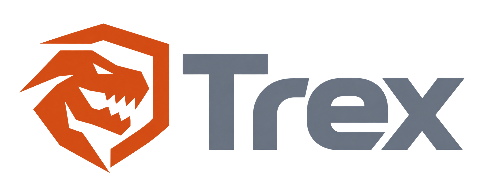

<p align="center">
  
  <br>
  <strong>Trex</strong>
  <br>
  An agentic execution engine built in Rust, powered by isolated sandboxes.
</p>

## Getting started

You need Rust, Node.js with pnpm, PostgreSQL, Redis, an OpenShell gateway with client certificates, and a model provider that speaks the OpenAI Responses API.

```sh
cp .env.example .env               # database, Redis and gateway settings
cp trex.toml.example trex.toml     # models and provider keys
# put the gateway's ca.crt, tls.crt and tls.key in certs/openshell/

# on the gateway host
podman build -t localhost/trex-sandbox:latest images/sandbox

pnpm --dir frontend install && pnpm --dir frontend build
cargo run
```

Open `http://127.0.0.1:8080`. API docs are at `/docs`.

## Development

```sh
cargo test --workspace
cargo clippy --workspace --all-targets
pnpm --dir frontend dev            # hot reload on :5173
cargo run -p trex-eval             # end-to-end evals against live services
```

## License

[Apache License, Version 2.0](LICENSE)
